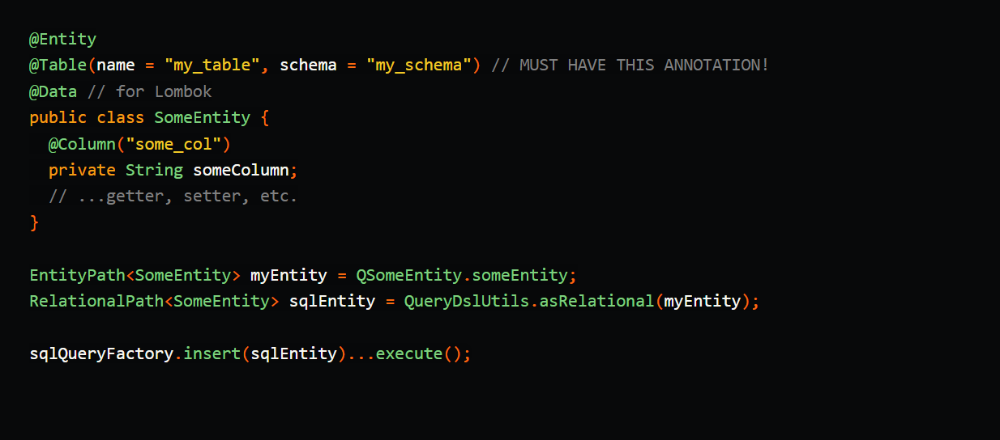

# How to use SQLQueryFactory with your QueryDSL JPA Entities

Even you want QueryDSL SQL features such as bulk insert, you are using queryDSL JPA, unfortunately there is no way to generate  ```RelationalPath<T>``` from ```EntityPath<T>``` automatically.


<div style="border: 1px solid #ddd; padding: 16px; border-radius: 8px; margin: 16px 0; box-shadow: 2px 2px 5px #eee;">
  <div style="font-size: 14px; color: #555;">
    <span style="background-color: #e0ecff; color: #0056d2; padding: 2px 6px; border-radius: 4px; font-weight: bold;">answer</span>
    <a href="https://stackoverflow.com/questions/33608023/how-to-generate-relationalpath-derived-class-using-querydsl-maven-plugin/53675800#53675800" style="margin-left: 8px; font-weight: bold; color: #0056d2; text-decoration: none;">
      re: How to generate RelationalPath Derived class using QueryDsl Maven plugin?
    </a>
  </div>

  <div style="margin-top: 12px; font-size: 14px; color: #333;">
    As <strong>@timo</strong> Westkämper feedback You can't turn it into a RelationalPath automatically<br><br>
    but you can create RelationalPathBase using your entityPath
  </div>

  <pre style="background-color: #f6f8fa; padding: 12px; border-radius: 6px; overflow-x: auto; font-size: 13px; margin-top: 10px;">
<code>RelationalPathBase relationalPathBase= new RelationalPathBase(this.entityPath.getType(), this.entityPath.getMetadata(), "yourSchemaName","yourTableName");</code>
  </pre>

  <p align="center">
  <a href="https://stackoverflow.com/questions/53665853/how-to-generate-relationalpath-derived-class-using-querydsl-maven-plugin" target="_blank">
    <strong>🔗 Open Full Answer</strong>
  </a>
  </p>


</div>

🔍 Notes:

But there's a good news. you can wrap **```RelationalPath<T>```** from **```EntityPath<T>```** manually like this. so, I made util class that wrap RelationalPath<T> from EntityPath<T>.


#### copy the class below, apply it, and use it.
```java
import com.querydsl.core.types.EntityPath;
import com.querydsl.sql.RelationalPath;
import com.querydsl.sql.RelationalPathBase;

import javax.persistence.Table;
import java.lang.reflect.AnnotatedElement;
import java.util.Objects;
import java.util.concurrent.ConcurrentHashMap;
import java.util.concurrent.ConcurrentMap;

public final class QueryDslUtils {

    /**
     * Simple Type cache (If you want another cache strategy, make it your own.)
     */
    private static final ConcurrentMap<EntityPath<?>, RelationalPath<?>> relationalMap = new ConcurrentHashMap<>();

    /**
     * Entity Class to SQLQueryFactory RelationalPath
     * @param entityPath
     * @param <T>
     * @return
     */
    @SuppressWarnings("unchecked")
    public static <T> RelationalPath<T> asRelational(EntityPath<T> entityPath) {
        AnnotatedElement annotatedElement = Objects.requireNonNull(Objects.requireNonNull(entityPath, "entityPath is null").getAnnotatedElement(), "no annotation");
        Table table = Objects.requireNonNull(annotatedElement.getAnnotation(Table.class), "no entity table");
        RelationalPath<?> result = relationalMap.get(entityPath);
        if(result == null)
            relationalMap.put(entityPath, result = new RelationalPathBase<T>(entityPath.getType(), entityPath.getMetadata(), table.schema(), table.name()));
        return (RelationalPath<T>) result;
    }
}

```

#### How to use? 
that's very simple. </br>
when you are using SQLQueryFactory, then just call QueryDslUtils.asRelational to wrap RelationalPath entity and use any SQLQueryFactory's clause.



### [Click for Sample Code 1](../code-generator/src/test/java/xio/ilan/test/BulkQueryDslSqlTest.java)
### [Click for Sample Code 2](../code-generator/src/test/java/xio/ilan/test/CustomQueryDslSqlTest.java)